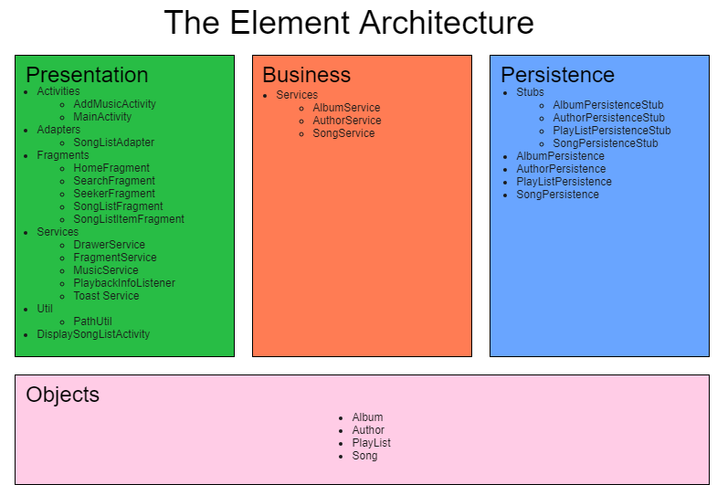

#  The Element Architecture 

The element application was designed using the 3-tier architecture structure. 
The 3 tiers are: 
* Presentation
* Business Logic
* Persistence. 

In addition to these three layers, the Domain models represent the objects that are shared between the three tiers. 

## Packages:
### Presentation
The Presentation package contains the layouts to display our application data and for the user interaction with the player. The presentation layer contains:
* Activities
 * AddMusicActivity - adding songs from external source
 * MainActivity - encapsulates the fragments
* Adapters
 * SongListAdapter - generates list view item for the song lists
* Fragments
 * HomeFragment
 * SearchFragment
 * SeekerFragment - this fragment persist throughout the MainActivity.  It provides song      information to users
 * SongListFragment
 * SongListItemFragment
* Services - initializes the objects to enable its use
 * DrawerService
 * FragmentService
 * MusicService
 * PlaybackInfoListener
 * ToastService
* Util
 * PathUtil - parses the metadata acquired from mp3 files and its path. This helps in creating the Domain objects

### Business.Services
The Business.Service package contains the Java classes that manage Persistence stubs. These classes handle objects and its logic and focuses on manipulating Songs, Authors, Albums, and any other domain objects.
-AlbumService.java
-AuthorService.java
-SongService.java

### Objects
The Objects package  stores the data needed by the three tiers. 
-Album.java
-Author.java
-PlayList.java
-Song.java

### Persistence
The persistence package is where data would be stored. It contains the stub package and ultimately the database of the application. The stub package is for storage and retrieval of data needed for the application and closely simulates how a database would behave. The stub store the data as a list implemented as an arrayList.
- Stubs - simulates a database. implements the Persistence interfaces
 - AlbumPersistenceStub
 - AuthorPersistenceStub
 - PlayListPersistenceStub
 - SongPersistenceStub
- AlbumPersistence.java
- AuthorPersistence.java
- PlayListPersistence.java
- SongPersistence.java

### Application
The application package initialises the persistence stubs and any other objects that would be used all throughout the application. It contains the main service class
-Services.java - Initializes the Persistence objects and the other Services objects in the Presentation.

### Architectural Diagram 
Below is a visual representation of the layout and structure of our application.

